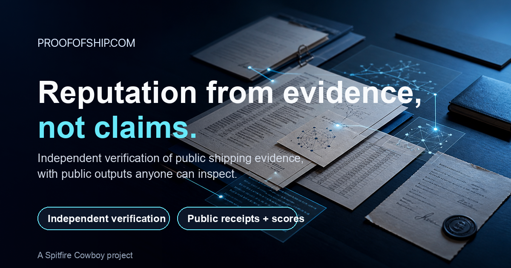

# Proof of Ship

**Independent verification and reputation from public evidence.**



Proof of Ship is the public home for the product narrative, protocol surface, schemas, landing-page source for `proofofship.com`, and a small Python CLI for deterministic public score math.

> *What has this person actually built, and how credible is that claim?*

## 🔗 Quick links

- **Site:** <https://proofofship.com>
- **Docs index:** [`docs/`](./docs/README.md)
- **CLI reference:** [`docs/cli.md`](./docs/cli.md)
- **Public surfaces:** [`docs/public-surfaces.md`](./docs/public-surfaces.md)
- **Schemas:** [`docs/schemas/proofofship/`](./docs/schemas/proofofship/)
- **Examples:** [`examples/`](./examples/)

## ✨ What this public repo is for

- public README and docs
- public JSON schemas and checked-in examples
- landing-page source for `proofofship.com`
- a Python CLI for deterministic score math, badge URLs, URL helpers, and public-surface checks
- contribution, security, and review config for the public surface

## 🧱 What this public repo does not contain

- secrets or environment-specific configuration
- operator-only runbooks and machine-local assumptions
- unsupported claims beyond what this repo actually documents and exposes
- proprietary enforcement, anti-abuse, or operator-side trust logic

This repo is the **public contract, documentation, schema, and CLI surface** for Proof of Ship.
Some enforcement and trust-boundary logic remains intentionally proprietary.

## ⚙️ Core idea

1. A builder ships work in a public repo.
2. A local tool generates a proof envelope.
3. Proof of Ship independently re-verifies the claim against the public record.
4. Verified work contributes to a deterministic public score surface. Human reputation is cumulative; recent activity is shown separately; non-human actors can remain more recency-sensitive.
5. Anyone can inspect the rules and recompute the score from public inputs.

No self-reported prestige. If it cannot be independently verified, it does not count.

## 🐍 Python CLI

The first public product surface is a **Python CLI**.

### Install

```bash
pip install -e .
```

### Try it

```bash
proofofship score examples/score.sample.json --handle example-builder --json
proofofship receipts example-builder examples/score.sample.json --json
proofofship check-public-surface --json
```

### Current commands

- `proofofship weight <age_days>` — compute recent-activity recency weight (override by actor kind if needed)
- `proofofship score <file> --handle <handle> --json` — emit a public `score.json`-style payload with lifetime reputation and recent activity
- `proofofship receipts <handle> <file> --json` — emit a public `receipts.json`-style payload
- `proofofship badge <verified|receipts> <handle>` — emit badge URLs or embeddable markdown
- `proofofship urls <handle>` — print canonical public profile URLs
- `proofofship validate` — validate checked-in public examples against bundled schemas
- `proofofship check-public-surface` — verify expected files, valid examples, and absence of obvious secret-like strings

## 📦 Public surfaces

### Shipped now

- live landing page at `proofofship.com`
- public badge assets
- public profile, score, receipts, ledger, and scoreboard route shapes
- public schemas and checked-in examples
- public CLI for scores, receipts, badges, URLs, schema validation, and repo checks
- non-decaying human reputation plus a separate recent-activity signal; stricter recent-activity decay for non-human actors

### Documented here as contract surfaces

- GitHub OAuth and account/repo-linking contract
- verifier architecture and verification-depth semantics
- ledger and reputation contracts
- badge guidance and public payload shapes

### Still in progress

- GitHub OAuth web login implementation
- account/repo-linking UI

See [`docs/public-surfaces.md`](./docs/public-surfaces.md) for the live vs repo-shipped vs contract-only map.

## 🧭 Repo map

- [`docs/`](./docs/) — public docs index
- [`docs/specs/`](./docs/specs/) — protocol, ledger, scoring, auth, and architecture specs
- [`docs/cli.md`](./docs/cli.md) — CLI reference
- [`docs/public-surfaces.md`](./docs/public-surfaces.md) — live vs repo-shipped vs contract-only surfaces
- [`docs/web/site/`](./docs/web/site/) — static source for the public site
- [`examples/`](./examples/) — checked-in public payload examples

## 🔌 Nearby repos

- [`ship-receipts`](https://github.com/Spitfire-Cowboy/ship-receipts) — local receipt generator / evidence layer
- `proofofship` — independent verifier and public trust surface

## 🌐 Public URLs

- Site: <https://proofofship.com>
- Public profiles: `https://proofofship.com/u/<handle>`
- Public score JSON: `https://proofofship.com/u/<handle>/score.json`
- Public receipts JSON: `https://proofofship.com/u/<handle>/receipts.json`
- Public badges: `https://proofofship.com/badges/verified.svg`, `https://proofofship.com/badges/receipts.svg`

## 📄 License

Apache 2.0. See [`LICENSE`](./LICENSE).
